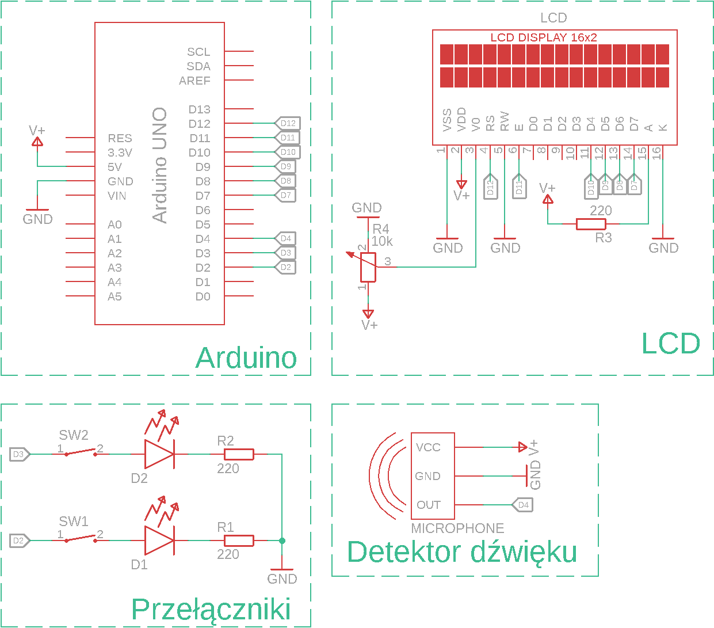

# Licznik wielokrotny

## Opis projektu

Urządzenia wejścia:

* Przyciski
* Czujnik dźwięku

Urządzenia wyjścia: 

* Ekran LCD
* Dioda LED

Układ będzie realizować funkcję trzech liczników, które będą się inkrementować przy podaniu im sygnału. Sygnał na pierwsze dwa liczniki będzie podawny poprzech kliknięcie przypisanego im przycisku, a licznik trzeci będzie inkrementowany poprzez podanie krótkiego donośnego dźwięku takiego jak klaśnięcie. Przy inkrementacji dwóch pierwszych liczników zostanie zapalona na pewien czas dioda LED.

## Realizacja:

Spis użytych elementów:

* 3 X Rezystor 220 WW
* 2 X Przycisk
* 2 X Dioda LED
* Potencjometr 10k WW
* Ekran LCD 16x2
* Takie coś do spawania LCD
* Czujnik dźwięku
* 18 X Przewód 
* Płytka prototypowa 
* Listwa kołkowa 

Aby podłaczyć ekran LCD do płytki prototypowej należalo przylutować listwę kołkową do układu z ekranem LCD. Następnie sporządzono i podłączono układ według poniższego schematu: 



## Opis kodu

```
void SetLCD()
{
  lcd.setCursor(p1, 1);
  lcd.print(l[0]);

  lcd.setCursor(p2, 1);
  lcd.print(l[1]);

  lcd.setCursor(p3, 1);
  lcd.print(l2);
}
```

Powyższy fragment kodu wysyła informacje do ekranu LCD o wartościach trzech liczników. Zmienne p1, p2, p3 ustawione są na liczby reprezentujące pozycje na ekranie LCD przeznaczone dla wartości liczników. 

```
void Pusc()
{
  for(int i = 0; i < 2; i++)
  {
    if(x[i] != digitalRead(i+2) && digitalRead(i+2) == 1 && !wait[i] && !wait2[i])    // odciśnięcie przycisku
    {
      wait[i] = true;
      wait2[i] = true;
      d[i] = millis();
    }
    x[i] = digitalRead(i+2);
  }
}
```

Pętla umożliwia przeskoczenie po obu licznikach sterowanych przeciskami. Komenda if porównuje wartość na pinach z wartością poprzedniej pętli, aby stwierdzić czy nastąpiło puszczenie przycisku. Flaga wait zapobiega potencjalnemu drżeniu styków. Flaga wait2 uniemożliwia wejście w warunek odciśnięcia przycisku bez uprzedniego jego przyciśnięciu. Poza warunkiem zapisywana jest wartość aktualna na pinie odpowiedzialnym za przycisk.

```
void Wcisk()
{
  for(int i = 0; i <= 2; i++)
  {
    if(x[i] != digitalRead(i+2) && digitalRead(i+2) == 0 && !wait[i])    // wciśnięcie przycisku
    {
      l[i]++;
      wait2[i] = false;
    }
  }
}
```

Powyżej jest realizowane wykrywanie wciśnięci przycisku. Inkrementowana zmienna l[i] zostanie wpisana w ekran LCD w wyżej opisanej komendzie SetLCD().

```
void NieCzekaj()
{
  for (int i = 0; i <= 1; i++)
  {
    if(wait[i] && millis() - d[i] > 50)      //ZMIEŃ WARTOŚĆ ŻEBY ZMIENIĆ DELAY
    {
      wait[i] = false;
    }
  }
}
```

Komenda ta odpowiedzialna jest za ustawienie minimalnego czasu puszczeniem a przyciśnięciem przycisku. Zapobiega to drżeniu styków. 

```
float mean()
{
  float sum = 0;
  m[n] = digitalRead(4);
  n++;
  if(n >=16)
    n = 0;
  for(int i = 0; i < 16; i++)
  {
    sum += m[i];
  }
  return sum / 16.0f;
  
}
```

Komenta ta wylicza średnią wartość sygnałów danych przez czujnik dźwięku. Czujnik użyty w układzie zwraca wartość binarną odpowiadającą czy urządzenie odebrało dźwiek czy nie. Obliczenie średniej z impulsów umożliwia w pewnym stopniu sprawdzanie intensywności uzyskanego dźwięku.

```
void Mikrofon()
{
  if(m2 && millis() - d3 > 500)         // MINIMALNY ODSTĘP MIĘDZY KLAŚNIĘCIAMI
  {
    m2 = false;
  }
  if(micro >= 0.15 && !m1 && !m2)       // ZMIEŃ WARTOŚĆ ŻEBY ZMIENIĆ CZUŁOŚĆ MIKROFONU
  {
    m1 = true;
    d3 = millis();
    return;
  }
  if(micro == 0.0f && m1)
  {
    if(millis() - d3 < 100)   // ZMIEŃ CZAS KLAŚNIĘCIA
    {
      m1 = false;
      l2++;
      m2 = true;
      d3 = millis();
    }
    else
    {
      m1 = false;
    }
  }
}
```

W komendzie tej realizowane jest ustawienie parametrów sygnału dźwiękowego. Najpierw sprawdzane jest, czy po poprzednim odebraniu poprawnego sygnału dźwiękowego wystąpił minimalny odstęp. Następnie porównuje się średnią z odebranych sygnałów z mikrofonu z ustawioną wartością. Pozwala to ustawić minimalną głośność sygnału dźwiękowego, który układ ma odbierać jako właściwy. Jeżeli warunek zostanie spełniony zapamiętuje się czas wystąpienia dźwięku i wychodzi się z komendy Mikrofon(). Następnie program oczekuje na otrzymanie wartości zerowej z obliczonej średniej i sprawdza, czy odebrany dźwięk był wystarczająco krótki aby stwierdzić, że było to klaśnięcie. Jeżeli tak, to program inkrementuje licznik oraz zapamiętuje czas od wystąpienia dźwięku. 

```
void loop() 
{
  NieCzekaj();
  Wcisk();
  Pusc();
  micro = mean();
  Mikrofon();
  SetLCD();
}
```

W pętli loop() odtwarzane są w określonej kolejności wcześniej ustalone komendy. 

```
void setup() 
{
  // set up the LCD's number of columns and rows:
  lcd.begin(16, 2);
  // Print a message to the LCD.
  lcd.print("Licznik 3-krotny");
  Serial.begin(9600);
  pinMode(2, INPUT_PULLUP);
  pinMode(3, INPUT_PULLUP);
  pinMode(4, INPUT_PULLUP);
}
```

W komendzie setup() ustawiane są parametry dotyczące ekranu LCD, wiadomość w jego pierwszej linijce, oraz tryb pracy pinów wejściowych. 

